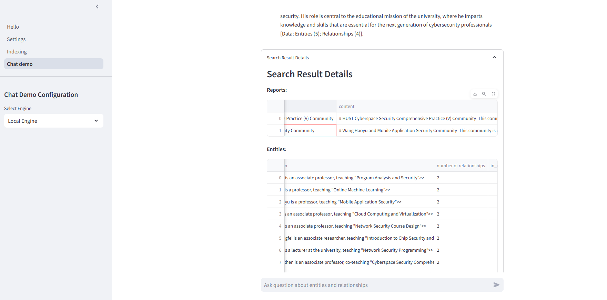

# 🖥️Simple-Graphrag

This is a project bout **GraphRAG Index/Prompt-Tuning/Querying/Chat UI**! This initiative is an adaptation of Microsoft's [GraphRAG](https://github.com/microsoft/graphrag) core. This project features a comprehensive and interactive user interface designed to enhance your experience using graphrag.


## 😍Key Features

- **Interactive User Interfaces**: Enjoy a rich and engaging UI for all your needs.
- **Prompt-Tuning**: Fine-tune prompts for optimal performance with ui integrated.
- **Querying**: Efficiently query and retrieve information.

## 🪄preview

### settings


*Configure your settings easily in the .env file.*

### indexing


*Indexing process overview.*

### chat ui


*Initial chat UI setup.*


*Chat interface in action.*


*Search information within the chat UI.*

## 🎢Getting Started

To get started with this project, please follow the instructions below:

1. **Clone the Repository**:

    ```sh
    git clone https://github.com/thethepai/Simple-Graphrag.git
    ```

2. **Install Dependencies**:

    poetry is strongly recommended to load and develop this project

    ```sh
    cd Simple-Graphrag
    pip install poetry
    poetry install
    ```

3. **Run the Application**:

    ```sh
    cd Simple-Graphrag
    poetry run poe run_app
    ```

## 📄Documentation

For detailed usage, please check the start page in the app and refer to the microsoft graphrag wiki:[Welcome to GraphRAG (microsoft.github.io)](https://microsoft.github.io/graphrag/)

## 🪟TODOs

- [ ] Fastapi support
  - Reason: Streamlit has high overhead and poor performance for backend tasks. FastAPI offers better performance and scalability.

- [ ] Nextjs frontend
  - Reason: Streamlit's frontend capabilities are limited and not suitable for complex UI requirements. Next.js provides a more robust and flexible frontend framework.
